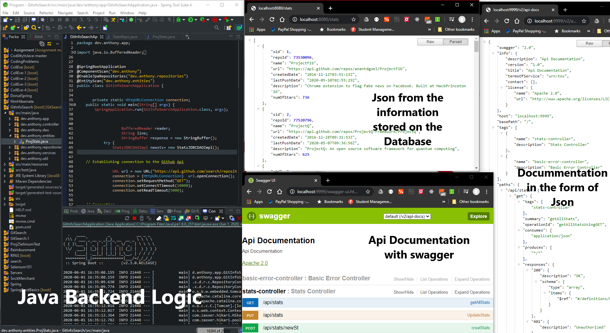

# GitSearchApp


This App uses the GitHub API to retrieve statistics of the top 25 most starred public Python projects.
The stored data includes the repository ID, name, URL, created date, last push date, description, and the number of stars.

## Architecture

The project is loosly coupled so the Backend and the Frontend can run independently.

Persistence Layer(AWS RDS) writen in SQL with ACID Properties in mind with the help of DBeaver(IDE).
Backend Logic(not hosted) writen in Java using SpringBoot Framework with the help of Eclipse(IDE).
Frontend(not hosted) writen in Typescript,html,css using Angular's Framework with the help of VsCode(IDE).


## Installation/SetUp

Backend

The application is a maven project implementing the Spring boot framework.
1) Install Eclipse or any other IDE that Can Run a java file.
2) Clone a copy of the project and open it in your IDE. 
3) click Run to start the application.
4) The documentation of the RestApi ends were handeled by Swagger.

Frontend

Its an angular project .
1) Install Visual Studio Code or any other IDE .
2) Clone a copy of the project and open it in your IDE. 
3) Run the application 

```angular
ng serve
```

## Execution

......Backend





All you need to do, is connect the Backend to any DataBase of your choice, with the help of anotations.
Object relational mapping in java enables you to bind columns to the fields of the entities with this anotations.

The Annotations Are......

```java
// Fields Mapped to the Table Columns in the DataBase
	@Id
	@GeneratedValue(strategy = GenerationType.IDENTITY)
	@Column(name ="S_ID")
	private int sid;
	
	@Column(name ="Repo_ID")
	private int repoId;
	
	@Column(name ="Name")
	private String name;
	
	@Column( name ="url")
	private String url;
	
	@Column(name ="CREATEDdate")
	private String createdDate;
	
	@Column(name ="LASTPUSHdate")
	private String lastPushDate;
	
	@Column(name ="DESCRIPTION")
	private String description;
	
	@Column(name="NumOFstars")
	private int numOfStars;
```

After the annotation is done, in your src/main/resources file you need to configure your data base in Java with a 
link(to your data base) username and password, when the connection is established, run the app to populate
the database. 

Below is an image of how the backend should look.


DataBase Data.....


......Frontend

When you run this command you should get a web page showing this localhost:4200

```angular
ng serve
```


 when you click on the button to fetch the information you should get this table 


You can get information from the Database or from the github's rest api as shown below.


